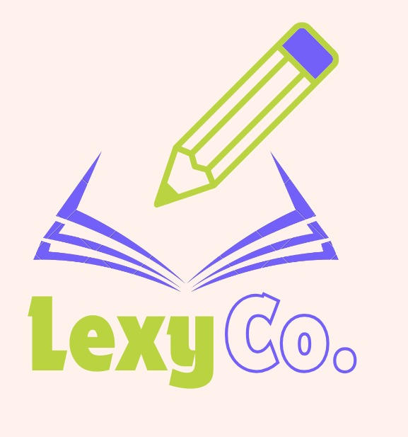

  

# 📚 LexyCo — Sistema de Gestión Educativa

Proyecto final de la materia **Programación I**  
Universidad Tecnológica de Panamá — Facultad de Ingeniería de Software

## 🧠 ¿Qué es LexyCo?

LexyCo es una aplicación enfocada en digitalizar y optimizar procesos administrativos dentro de instituciones educativas. Está diseñada pensando en la escalabilidad, con posibilidad de expansión hacia módulos académicos y estudiantiles en futuras versiones.
Actualmente en etapa de desarrollo, el sistema incluye funcionalidades centrales para el área administrativa como gestión de usuarios, control de acceso, y conexión a base de datos.

---

## 🎯 Objetivos del Proyecto

- Automatizar tareas administrativas en centros educativos.
- Desarrollar una solución robusta y escalable usando Java.
- Aplicar buenas prácticas de programación y trabajo colaborativo.
- Promover el uso de software libre y accesible en entornos educativos.

---

## ⚙️ Tecnologías Utilizadas

| Tecnología | Propósito                           |
|------------|-------------------------------------|
| **Java**   | Lógica de la aplicación             |
| **MySQL**  | Manejo de datos                     |
| **GitHub** | Control de versiones y colaboración |

## 👨‍💻 Autores

- Maria Lourdes Goods
- Ángel Paul
- Lavisha Mirchandani
- Ashley Martínez

*Proyecto desarrollado por estudiantes de Ingeniería de Software de la **Universidad Tecnológica de Panamá***
Materia: Programación I
Docente guía: Prof. Rodrigo Yángüez

---

## 🚧 Estado del Proyecto

🔹 Versión Beta activa  
🔹 Funciones básicas de gestión administrativa completadas  
🔹 En desarrollo mejoras de interfaz y funcionalidades.

---

## 📄 Licencia
Uso académico — El repositorio es público para fines de visualización.  

